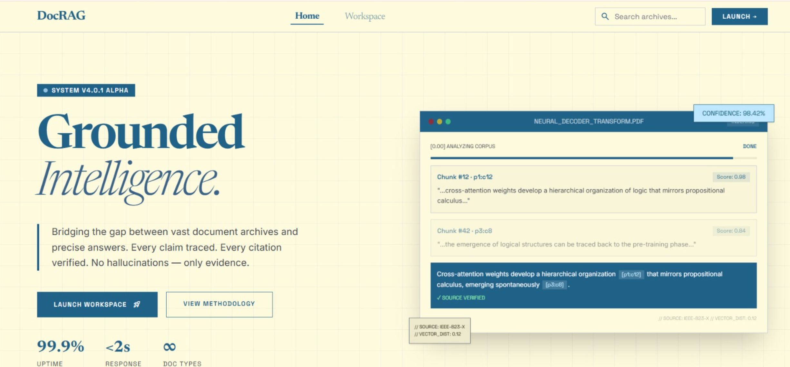
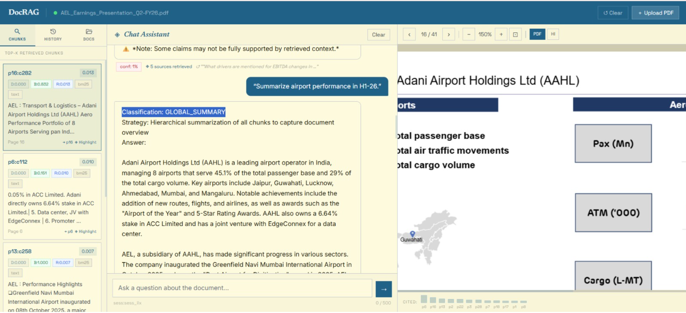
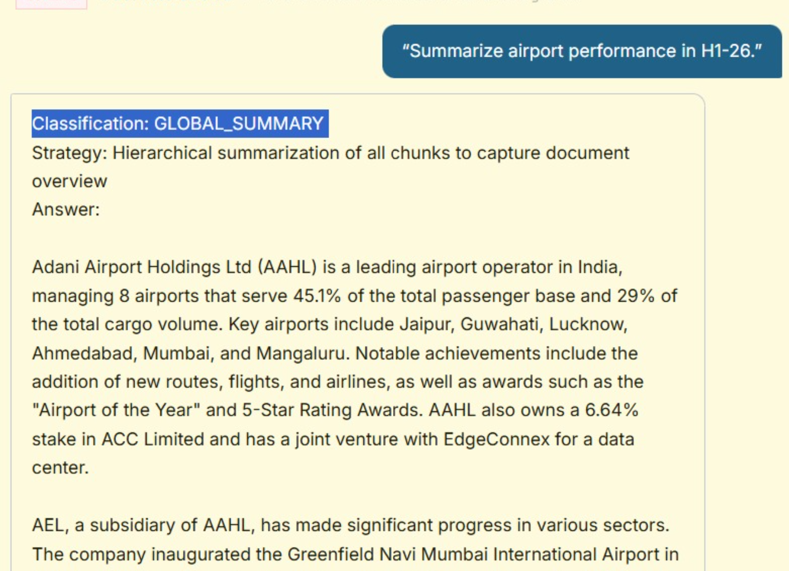
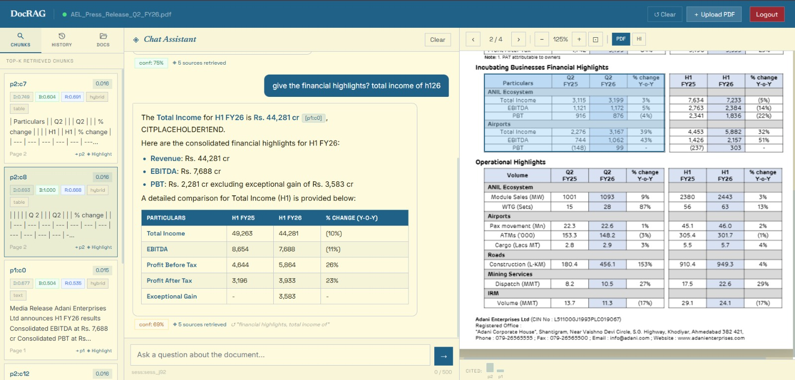
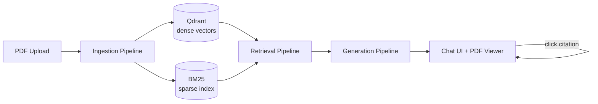

# DocRAG — Grounded Document Intelligence

A multi-user RAG system for PDF Q&A. Every answer is generated **exclusively** from retrieved chunks of your document, every claim is tagged with a clickable `[pN:cN]` citation, and a hallucination-check pass verifies the answer before it's shown. If the document doesn't contain the answer, DocRAG says so instead of guessing.


[docrag1.png](docrag1.png)

## Why

Most "chat with your PDF" tools either hallucinate or bury you in raw retrieved text with no way to verify a claim. DocRAG closes the loop: **retrieve → verify → cite → display**, with a live evidence panel that shows exactly which chunks (and which retrieval method — dense, BM25, or hybrid) produced each part of the answer, and a PDF viewer that jumps straight to the highlighted source region when you click a citation.


[docrag2.png](docrag2.png)

## Features

- **Hybrid retrieval** — dense vector search (Gemini embeddings via Qdrant) + BM25 keyword search, merged with Reciprocal Rank Fusion, then re-ordered by a cross-encoder reranker (`ms-marco-MiniLM-L-6-v2`)
- **Grounded generation** — the LLM is instructed to answer *only* from the supplied chunks and to tag every claim with its source chunk ID; a second LLM pass audits the answer against the source context and flags ungrounded claims
- **Refuses to guess** — if the top retrieved chunk scores below the relevance threshold, DocRAG returns "Not found in the document" instead of calling the LLM
- **Clickable citations** — `[p12:c3]` tags in the answer jump the PDF viewer to that page and draw a highlight box over the exact source region (bounding boxes are tracked from extraction through indexing)
- **Multimodal ingestion** — a LangGraph pipeline detects page layout and routes each block (text, title, table, figure) to a specialized extractor, with OCR/vision fallback for scanned or image-heavy pages
- **Conversational memory** — follow-up questions are rewritten into standalone queries using chat history before retrieval
- **Multi-user accounts** — email/password auth (MongoDB), each user gets their own workspace with its own Qdrant collection, so retrieval never crosses workspaces (see [Known Limitations](#known-limitations) for a gap in this isolation)
- **Evidence panel** — inspect top-k retrieved chunks with their dense/BM25/rerank scores and retrieval method for every query
- **Streaming responses** — answers stream token-by-token over SSE


[docrag3.png](docrag3.png)


[docr.jpeg](docr.jpeg)

## How it works



**1. Ingestion** — `core/multimodal/extractor.py` runs a LangGraph state machine per page: load page → detect layout blocks → route each block to a text/title/table/figure handler → merge results (falls back to plain PyMuPDF extraction on failure). `core/ingestion/chunker.py` then slices the merged content into chunks (~800 chars, page/bbox-tracked, tables kept atomic), and `core/ingestion/indexer.py` embeds each chunk with Gemini and writes it to a per-workspace Qdrant collection while building a parallel BM25 index.

**2. Retrieval** — `core/retrieval/retriever.py` runs dense search and BM25 search in parallel, fuses them with Reciprocal Rank Fusion, and `core/retrieval/reranker.py` re-scores the fused set with a cross-encoder. `grade_relevance_node` checks the top score against `RETRIEVAL_SCORE_THRESHOLD` and short-circuits to "not found" if nothing clears the bar.

**3. Generation** — `core/generation/prompts.py` builds a strict grounded-answer prompt (context chunks only, mandatory `[pN:cN]` citation on every claim), calls Gemini (with a Groq fallback), and extracts the citation IDs from the response. A second "auditor" prompt checks the answer against the source context and sets `is_grounded`.

**4. Interface** — `frontend/static/js/app.js` renders the answer with clickable citation chips and the evidence panel side-by-side; `pdf_viewer.js` handles page navigation and highlight overlays; `evidence_panel.js` renders the retrieved-chunk cards with their score badges.

The whole thing is orchestrated by two LangGraph graphs: `core/multimodal/graph.py` (ingestion) and `core/graph/rag_graph.py` (query → retrieve → rerank → grade → generate → verify → update memory).

## Stack

| Layer | Technology |
|-------|-----------|
| LLM | Gemini 2.0 Flash (Groq as fallback) |
| Embeddings | Gemini `text-embedding-004` |
| Sparse retrieval | BM25 (`rank-bm25`, local) |
| Reranker | `cross-encoder/ms-marco-MiniLM-L-6-v2` (local) |
| Vector store | Qdrant (local or remote) |
| Orchestration | LangGraph |
| PDF parsing | PyMuPDF + pdfplumber |
| Multimodal / OCR | PaddleOCR / PaddleX + Gemini Vision |
| Auth & metadata | MongoDB |
| Web | Flask |

## Setup

### 1. Clone and enter the project

```bash
git clone <repo>
cd DocRag_Zip
```

### 2. Create a virtual environment

```bash
python -m venv venv

# Linux/Mac
source venv/bin/activate

# Windows
venv\Scripts\activate
```

### 3. Install dependencies

```bash
pip install -r requirements.txt
```

> First run downloads the cross-encoder reranker (~90MB) and PaddleOCR models automatically.

### 4. Start MongoDB

DocRAG stores users, workspaces, documents, and conversations in MongoDB. Point `MONGO_URI` at a local instance or a hosted cluster (e.g. MongoDB Atlas).

### 5. Configure environment variables

```bash
cp .env.example .env
```

Fill in at minimum `GEMINI_API_KEY`, `MONGO_URI`, and `FLASK_SECRET_KEY` — see [Environment Variables](#environment-variables) below.

Get a free Gemini API key at [aistudio.google.com](https://aistudio.google.com/).

### 6. Run the application

```bash
python app.py
```

Open **http://localhost:5000**, sign up, and you'll land in your workspace.

## Usage

1. **Sign up / log in** — an account gets you an isolated workspace (separate documents and Qdrant collection)
2. **Upload a PDF** — ingestion runs in the background; progress streams live via SSE
3. **Ask a question** — type in the chat box; follow-ups are automatically rewritten with conversation context
4. **Read the grounded answer** — every claim carries a `[pN:cN]` citation chip
5. **Click a citation** — the PDF viewer jumps to that page and highlights the exact source region
6. **Inspect the evidence** — open the evidence panel to see every retrieved chunk with its dense/BM25/hybrid/rerank scores

## Running Tests

```bash
# Unit tests (no document needed)
pytest tests/test_ingestion.py tests/test_retrieval.py -v

# All tests
pytest tests/ -v
```

## Project Structure

```
DocRag_Zip/
├── app.py                        # Flask app: auth, upload, chat, PDF/highlight serving
├── core/
│   ├── db.py                     # MongoDB: users, workspaces, documents, conversations
│   ├── ingestion/
│   │   ├── pdf_extractor.py      # PyMuPDF/pdfplumber extraction + highlight rendering
│   │   ├── chunker.py            # Deterministic, bbox-tracked chunking
│   │   └── indexer.py            # Qdrant + BM25 indexing (per-workspace collections)
│   ├── multimodal/
│   │   ├── extractor.py          # LangGraph entry point for multimodal extraction
│   │   ├── graph.py, nodes.py    # Per-page layout detection → routed extraction graph
│   │   ├── ocr.py, vision.py     # PaddleOCR + Gemini Vision handlers
│   │   ├── table.py, routing.py, utils.py
│   ├── retrieval/
│   │   ├── retriever.py          # Dense + BM25 hybrid search, RRF fusion
│   │   └── reranker.py           # Cross-encoder reranking
│   ├── generation/
│   │   ├── llm.py                # Gemini client (+ Groq fallback), embeddings
│   │   └── prompts.py            # Query rewrite, grounded-answer, hallucination-check prompts
│   └── graph/
│       ├── state.py               # LangGraph RAG state
│       ├── nodes.py               # rewrite → retrieve → rerank → grade → generate → verify
│       └── rag_graph.py           # Graph definition + run_rag_pipeline entry point
├── frontend/
│   ├── templates/
│   │   ├── landing.html          # Marketing landing page
│   │   └── index.html            # Workspace UI (chat + PDF viewer + evidence panel)
│   └── static/
│       ├── css/style.css
│       └── js/
│           ├── app.js            # Chat state, upload flow, citation click handling
│           ├── pdf_viewer.js      # PDF rendering + highlight overlays
│           └── evidence_panel.js  # Retrieved-chunk cards with score badges
└── tests/
    ├── test_ingestion.py
    ├── test_retrieval.py
    └── golden_qa.json
```

## Environment Variables

| Variable | Required | Default | Description |
|----------|----------|---------|-------------|
| `GEMINI_API_KEY` | ✅ | — | From aistudio.google.com |
| `MONGO_URI` | ✅ | `mongodb://localhost:27017/` | Auth, workspaces, documents, conversations |
| `FLASK_SECRET_KEY` | ✅ | — | Random hex string (`python -c "import secrets; print(secrets.token_hex(32))"`) |
| `GROQ_API_KEY` | ❌ | — | Fallback LLM |
| `FLASK_PORT` | ❌ | 5000 | App port |
| `FLASK_DEBUG` | ❌ | True | Flask debug mode |
| `QDRANT_MODE` | ❌ | local | `local` or `remote` |
| `QDRANT_LOCAL_PATH` | ❌ | `./storage/qdrant_data` | Local Qdrant storage path |
| `QDRANT_HOST` / `QDRANT_PORT` / `QDRANT_API_KEY` | ❌ | — | Used when `QDRANT_MODE=remote` |
| `TOP_K_RETRIEVAL` | ❌ | 10 | Chunks retrieved per method before fusion/rerank |
| `TOP_K_AFTER_RERANK` | ❌ | 5 | Chunks sent to the LLM |
| `RETRIEVAL_SCORE_THRESHOLD` | ❌ | 0.35 | Min top-chunk score to attempt an answer |
| `MAX_UPLOAD_SIZE_MB` | ❌ | 50 | Max PDF size |
| `GEMINI_LLM_MODEL` / `GEMINI_EMBEDDING_MODEL` / `GEMINI_VISION_MODEL` | ❌ | see `.env.example` | Model overrides |

## How Citations Work

Every chunk gets a deterministic ID during ingestion: `p{page}:c{chunk_index}`.

- `[p2:c3]` = page 2, 3rd chunk on that page
- The ID (plus its bounding box) is stored in Qdrant and the BM25 index alongside the chunk
- Retrieved chunks are passed to the LLM pre-tagged with their IDs — the prompt requires every claim to cite one
- The frontend parses `[pN:cN]` patterns in the answer into clickable chips
- Clicking a chip fetches the chunk's bounding box, jumps the PDF viewer to that page, and overlays a highlight box

The LLM never invents citation IDs — it can only reuse the ones already attached to the context it was given, and a hallucination-check pass audits the final answer against the source chunks before it's returned.

## Known Limitations

- **Document ID / upload-path collision across workspaces.** `doc_id` is derived only from the sanitized filename ([app.py:76-79](app.py:76)), and uploaded PDFs are written to a single shared folder keyed by filename (`UPLOAD_FOLDER/{filename}`, [app.py:176](app.py:176)) — neither is scoped by user or workspace. If two different users upload a PDF with the same filename (e.g. `report.pdf`):
  - The second upload's `file.save()` overwrites the first user's PDF file on disk ([app.py:192](app.py:192)).
  - The shared MongoDB document row (`_id: doc_id`) still belongs to the first user's `workspace_id`; the second user's upload just resets its status ([app.py:199](app.py:199)) without reassigning ownership, so their ingested document never shows up in *their own* document list.
  - The first user's PDF viewer/highlight rendering will subsequently serve the second user's (overwritten) file content when resolving that `doc_id`, even though their indexed text/vectors remain correctly isolated in their own Qdrant collection.
  - Net effect: Qdrant vector search is properly workspace-isolated, but raw PDF file storage and document metadata are not — this is a real cross-user data leak triggered by a filename coincidence, not a deliberate attack.
- **BM25 index is not workspace-scoped.** The sparse index is saved as `storage/bm25_index/{doc_id}.pkl` ([core/ingestion/indexer.py:196](core/ingestion/indexer.py:196)) with no workspace prefix, so it inherits the same collision risk described above.
- **No email verification or password reset flow** — signup/login is bare email+password ([core/db.py](core/db.py)).
- **In-memory ingestion progress** (`ingestion_status_live` in [app.py:71](app.py:71)) is a plain process-local dict — progress polling will break across multiple app workers/processes, and resets on restart.

## License

MIT — see [LICENSE](LICENSE).
